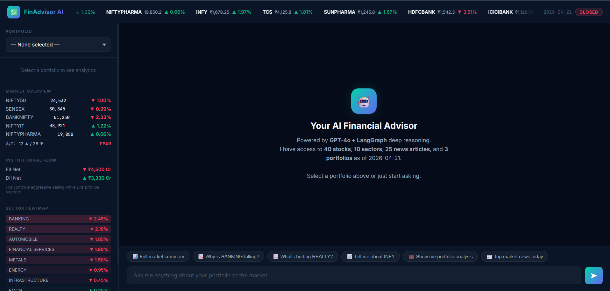
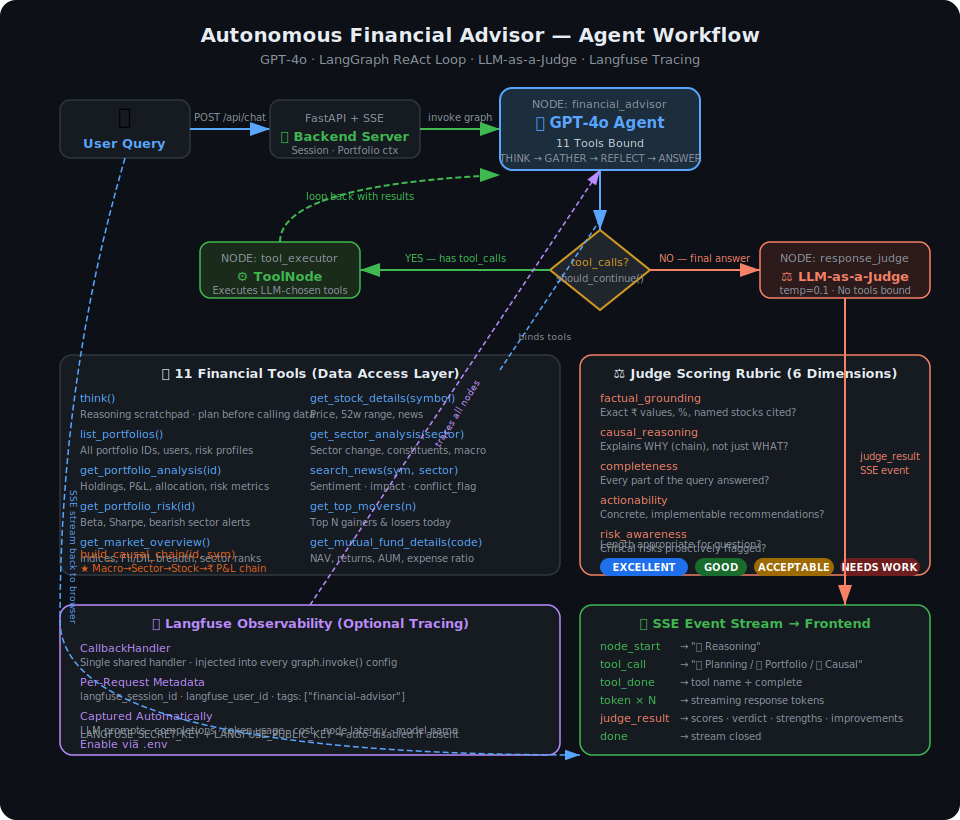

# Autonomous Financial Advisor Chat Agent

> **An AI agent that doesn't just report financial data — it reasons through it.**
> GPT-4o + LangGraph ReAct loop · 11 financial tools · causal chain engine · LLM-as-a-Judge · real-time SSE streaming

---



---

## Tech Stack

| Layer | Technology |
|---|---|
| LLM | GPT-4o via `langchain-openai` |
| Agent Framework | LangGraph `StateGraph` — true ReAct loop |
| Backend | FastAPI + Server-Sent Events (SSE streaming) |
| Tracing | Langfuse (optional — auto-disabled if keys absent) |
| Config | Pydantic `BaseSettings` + `.env` |
| Frontend | Vanilla JS + CSS — fully dynamic, no hardcoded data in HTML |

---

## Agent Workflow Diagram



---

## Architecture — The ReAct Agent

The core design is a **true ReAct loop** — the LLM autonomously decides which tools to call, in what order, and how many times, based entirely on the user's question. No fixed pipeline, no pre-fetched data stuffed into prompts.

```
                          User Query
                              │
                              ▼
                ┌─────────────────────────────────┐
                │      financial_advisor          │  ← GPT-4o + 11 tools bound
                │                                 │
                │  Each turn the LLM receives:    │
                │  · Dynamic SYSTEM_PROMPT        │
                │  · Full conversation history    │
                │  · All prior tool call results  │
                └────────────────┬────────────────┘
                                 │
                    ┌────────────┴────────────┐
                    │ has tool_calls?         │
                   YES                        NO
                    │                         │
                    ▼                         ▼
        ┌───────────────────┐    ┌────────────────────────┐
        │   tool_executor   │    │    response_judge      │
        │   (ToolNode)      │    │                        │
        │                   │    │  Isolated LLM call     │
        │  Executes tools   │    │  temperature = 0.1     │
        │  the LLM chose.   │    │  No tools bound        │
        │  Results returned │    │  Scores 6 dimensions   │
        │  to agent state.  │    │  → verdict + feedback  │
        └─────────┬─────────┘    └────────────┬───────────┘
                  │ loops back                 │
                  └──────────────►            END
                                      (judge_result → SSE → UI)
```

### Agent Planning Protocol (from `SYSTEM_PROMPT`)

The LLM is instructed to follow a 4-step protocol on every query:

```
1. THINK   → Call think() — write the plan: what tools, in what order, what to cross-reference
2. GATHER  → Call the data tools the plan identified (can be 1 or many)
3. REFLECT → If results reveal a conflict signal or hidden risk → think() again
4. ANSWER  → Write response using ONLY numbers and facts from tool results
```

Multi-hop reasoning examples baked into the prompt:
```
"Why is my portfolio down?"
    → think → get_portfolio_analysis → build_causal_chain → search_news → answer

"Should I buy more INFY?"
    → think → get_stock_details(INFY) → get_sector_analysis(IT) → search_news(INFY) → get_market_overview → answer

"Which sector is best today?"
    → think → get_market_overview → answer      ← single hop is sufficient
```

---

## Project Structure

```
financial_advisor_agent/
│
├── config.py                        # All settings from .env — zero hardcoding
├── run.py                           # python run.py → starts server
├── .env.example                     # Copy to .env, add OPENAI_API_KEY
│
├── data_layer/                      ← Phase 1 + 2: Market Intelligence + Portfolio Analytics
│   ├── loader.py                    # Reads 6 JSON files once at startup
│   ├── registry.py                  # DataRegistry: auto-discovers all entities at runtime
│   ├── portfolio_analyzer.py        # P&L, allocation, risk flags, causal summary per holding
│   ├── market_analyzer.py           # Index trends, sector ranking, FII/DII, breadth
│   └── news_processor.py            # Sentiment classification, causal chain builder, conflict detection
│
├── agent/                           ← Phase 3 + 4: Autonomous Reasoning + Self-Evaluation
│   ├── state.py                     # AgentState: messages, session_id, portfolio_id, judge_result
│   ├── graph.py                     # LangGraph StateGraph — 3 nodes, conditional edges, MemorySaver
│   ├── tracing.py                   # Langfuse CallbackHandler (no-op if keys missing)
│   ├── prompts/templates.py         # SYSTEM_PROMPT (planning protocol) + JUDGE_PROMPT (6-dim rubric)
│   ├── tools/financial_tools.py     # 11 @tool functions — only data access path for the LLM
│   └── nodes/judge.py               # LLM-as-a-Judge node — isolated scoring call
│
├── app/                             ← FastAPI Server + SSE
│   ├── main.py                      # Lifespan startup: data → registry → LLM → graph → app.state
│   └── routes/
│       ├── chat.py                  # POST /api/chat — SSE stream with tool_call + judge events
│       ├── registry.py              # GET /api/registry — entity discovery for frontend
│       ├── portfolio.py             # GET /api/portfolio/{id}
│       └── market.py                # GET /api/market/*
│
└── frontend/
    ├── index.html                   # Pure HTML shell — zero financial data in markup
    ├── style.css                    # Dark glassmorphic UI + judge score panel
    └── script.js                    # Calls /api/registry on load, builds all UI elements dynamically
```

---

## The 11 Tools (`agent/tools/financial_tools.py`)

All tools are `@tool`-decorated functions injected with the data layer via closure. The LLM never reads files directly — every data point in the final response must come from a tool result.

| # | Tool | Returns |
|---|------|---------|
| 0 | `think(thought)` | Scratchpad — LLM writes its reasoning plan before calling data tools |
| 1 | `list_portfolios()` | All portfolio IDs, user names, types, risk profiles, values |
| 2 | `get_portfolio_analysis(portfolio_id)` | Holdings (stocks + MFs), daily P&L abs+%, sector allocation, asset-type allocation, risk metrics, risk flags, causal summary |
| 3 | `get_portfolio_risk(portfolio_id)` | Risk flags cross-referenced with live market sentiment, beta, Sharpe, conflict signals |
| 4 | `get_market_overview()` | All indices, 10 sectors ranked, top movers, FII/DII flows, advance/decline breadth, macro themes |
| 5 | `get_stock_details(symbol)` | Price, % change, 52w high/low, volume, sector performance, related news |
| 6 | `get_sector_analysis(sector)` | Sector change + sentiment, all constituents, weekly trend, macro correlation factors |
| 7 | `search_news(symbol, sector, top_n)` | Headlines with sentiment score, impact level, scope, causal factors, `conflict_flag` |
| 8 | `get_top_movers(n)` | Top N gainers + losers with symbol, price, % change, sector |
| 9 | `get_mutual_fund_details(scheme_code)` | NAV, 1Y/3Y/5Y returns, AUM, expense ratio, fund manager, top holdings |
| 10 | `build_causal_chain(portfolio_id, symbol)` | **Core tool** — traces macro news → sector → portfolio stocks → ₹ P&L contribution. Returns `causal_chains[]` + `conflict_flags[]` |

---

## Causal Chain — The Core Reasoning Layer

`build_causal_chain` is the engine behind the assignment's core requirement:

```
Macro News → Sector Trends → Individual Stock → Portfolio P&L Impact
```

For each HIGH/MEDIUM impact news event that touches the portfolio's holdings:

```python
{
  "headline":                  "RBI raises repo rate by 50bps",
  "sentiment_score":           -0.75,
  "impact_level":              "HIGH",
  "affected_stocks":           ["HDFCBANK", "ICICIBANK", "SBIN"],   # intersected with holdings
  "affected_sectors":          ["BANKING"],
  "causal_factors":            ["Higher rates compress NIM", "Loan growth slows"],
  "pnl_contribution_estimate": -34200                                 # ₹ impact on portfolio
}
```

**Conflict resolution:** Articles with `conflict_flag=true` (positive news, falling price) are surfaced separately. The agent's system prompt mandates flagging these and explaining the ambiguity.

---

## LLM-as-a-Judge (`agent/nodes/judge.py`)

After every final response, a **second isolated LLM call** scores quality across 6 dimensions:

| Dimension | What it measures |
|---|---|
| `factual_grounding` | Real ₹ values, exact %, named stocks — not vague summaries |
| `causal_reasoning` | Explains WHY (causal chain), not just WHAT (data dump) |
| `completeness` | Every part of the user's question answered |
| `actionability` | Recommendations are concrete and implementable |
| `risk_awareness` | Critical risks proactively flagged even if not asked |
| `conciseness` | Response length matches question complexity |

Verdict options: `EXCELLENT · GOOD · ACCEPTABLE · NEEDS_IMPROVEMENT`

The score panel renders live in the frontend below every AI response bubble.

---

## Observability

- **Langfuse tracing** — `agent/tracing.py` wraps every graph run: tracks every LLM prompt, completion, token usage, and latency per node. Enable via `LANGFUSE_SECRET_KEY` + `LANGFUSE_PUBLIC_KEY` in `.env`.
- **Confidence score** — every response ends with `**Confidence: HIGH/MEDIUM/LOW**` + justification, enforced by the SYSTEM_PROMPT.
- **SSE reasoning tracker** — frontend shows each tool call firing in real time (`💭 Planning → 💼 Portfolio → 🔗 Causal chain`) before the response streams.

---

## Langfuse — Full Tracing Integration

`agent/tracing.py` implements a **production-ready Langfuse integration** using the official LangChain callback approach.

### How It Works

```
get_langfuse_handler()            ← singleton: one handler shared across all requests
        │
        ▼
LangfuseCallbackHandler()         ← langfuse.langchain.CallbackHandler
        │
        ├── injected into graph.invoke(config={"callbacks": [handler]})
        │
        ├── per-request metadata set in config:
        │       langfuse_session_id  → ties all turns of a chat into one trace
        │       langfuse_user_id     → per-user cost tracking
        │       langfuse_tags        → ["financial-advisor"]
        │
        └── flush_langfuse() called after SSE stream closes
                → ensures all batched events are sent before connection drops
```

### What Langfuse Captures Automatically

| Signal | Details |
|---|---|
| **LLM Prompts** | Full `SystemMessage` + `HumanMessage` + tool result messages per node turn |
| **LLM Completions** | Raw GPT-4o output — tool call JSON or final response text |
| **Token Usage** | `prompt_tokens` · `completion_tokens` · `total_tokens` per call |
| **Cost** | Auto-calculated from token counts + model name |
| **Node Latency** | Per-span timing: `financial_advisor` · `tool_executor` · `response_judge` |
| **Model Name** | Enables model comparison if you swap GPT-4o for another model |
| **Tool Calls** | Each tool the LLM called — name + arguments + result |
| **Judge Scores** | The 6-dimension scores are visible as a separate span |

### Enable Tracing

Add to `.env`:
```env
LANGFUSE_PUBLIC_KEY=pk-lf-...
LANGFUSE_SECRET_KEY=sk-lf-...
LANGFUSE_BASE_URL=https://cloud.langfuse.com   # or your self-hosted URL
```

If keys are absent, `get_langfuse_handler()` returns `None` and all tracing is silently skipped — **no code changes needed, zero runtime errors**.

### Key Implementation Details

- **Singleton pattern** — one `CallbackHandler` created at startup and reused across requests. Session/user context is passed per-request via `config["metadata"]`, not at handler creation time.
- **Correct import** — uses `langfuse.langchain.CallbackHandler` (not the deprecated `langfuse.callback` path).
- **env injection** — `pydantic-settings` loads `.env` into a `Settings` object but does NOT set `os.environ`. The tracing module explicitly injects the three keys so the Langfuse SDK can read them.
- **Flush discipline** — `flush_langfuse()` is called at the end of every SSE stream. Without this, batched trace events can be lost when the async connection closes.

---

## SSE Event Stream (`POST /api/chat`)

```
node_start   → "🧠 Reasoning"
tool_call    → "💭 Planning next steps"         (think)
tool_call    → "💼 Analysing portfolio"         (get_portfolio_analysis)
tool_done    → get_portfolio_analysis complete
tool_call    → "🔗 Building causal chain"       (build_causal_chain)
token × N    → streaming final response tokens
judge_result → {scores, overall, verdict, strengths, improvements}
done
```

---

## Setup

```powershell
# 1. Install
pip install -r requirements.txt

# 2. Configure
copy .env.example .env
# Set OPENAI_API_KEY=sk-...

# 3. Run
python run.py
```

- **App:** http://localhost:8000  
- **API docs:** http://localhost:8000/docs

---

## Key Design Decisions

**ReAct over a fixed pipeline** — Simple queries complete in 1 tool call (~2s). Complex multi-part queries scale to 5–6 tool calls with full multi-hop reasoning. No wasted LLM calls on irrelevant nodes.

**Isolated judge call** — The judge needs the *complete* response to score it, so it runs after the agent finishes. `temperature=0.1` with no tools bound gives deterministic, objective scores.

**Zero hardcoding via `DataRegistry`** — All portfolio IDs, stock symbols, sector names, and news IDs are discovered at runtime by scanning the JSON files. Add a new portfolio to the data file — the agent, API, and frontend all pick it up automatically.

**`think` as a tool (not prose)** — Making planning a tool call creates an explicit trace in Langfuse and forces the LLM to commit its reasoning plan before fetching any data.
